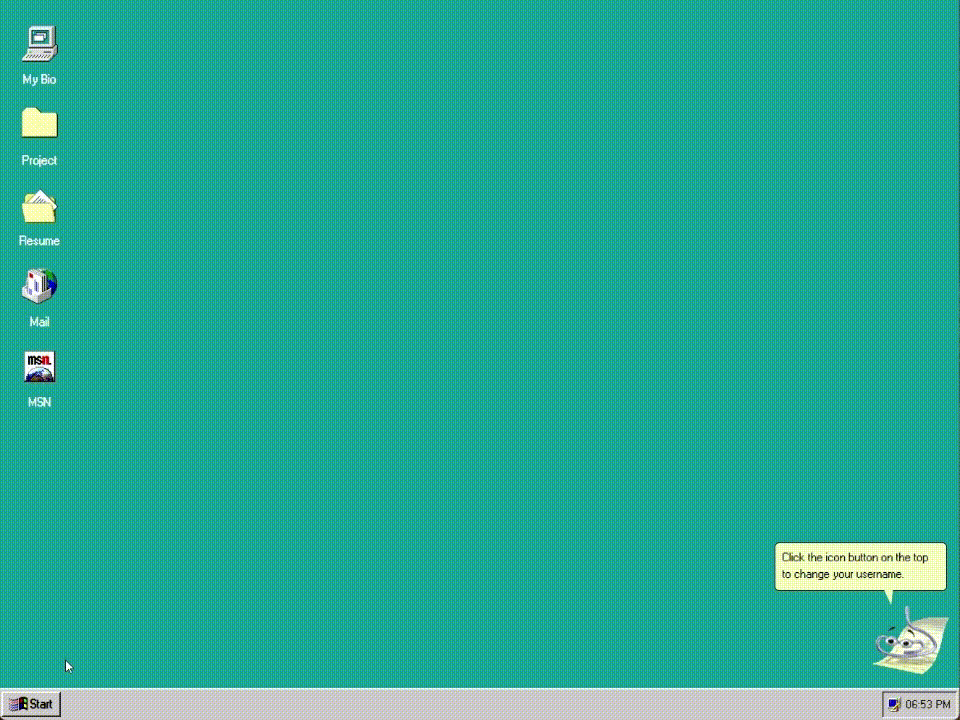
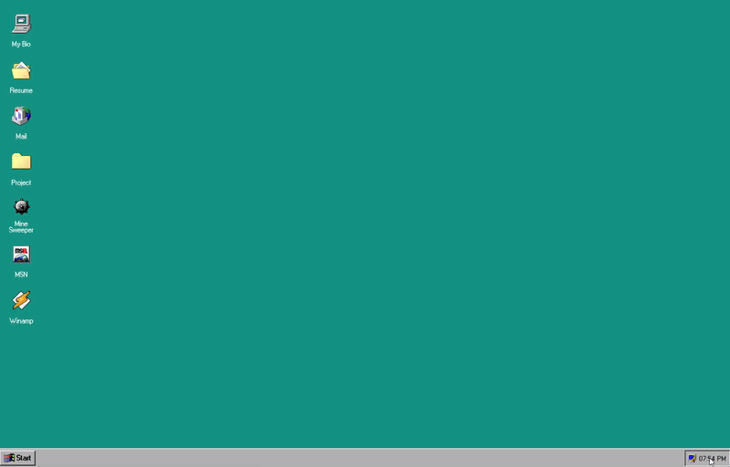

# Windows 95 Portfolio

**Live Demo:** [https://pratik-kamath.github.io/portfolio/](https://pratik-kamath.github.io/portfolio/)

A fully interactive Windows 95-themed portfolio built with React. It features a complete desktop environment with draggable windows, a start menu, and functional applications.

## Featured Functionality

### Login Screen

### Drag and Drop

### Customization (Icon Size & Background)

### Calendar

### Games (Minesweeper)

## Key Features

### 🖥️ Desktop Environment
*   **Window Management**: Full support for dragging, resizing, minimizing, and maximizing windows.
*   **Start Menu**: Interactive start menu with sub-menus and shortcuts.
*   **Taskbar**: Active application tracking and clock/calendar.

### 📱 Applications
*   **My Computer**: Navigate through drives (C:, D:) and folders.
*   **Winamp**: Fully functional music player integration (powered by Webamp).
*   **Mail**: Send emails directly from the desktop (powered by Web3Forms).
*   **Projects & Resume**: Showcase of professional work and resume in a file-explorer style.
*   **Certifications**: Sub-folder inside Resume containing credential badges with click-through to verify.
*   **About**: Tabbed dialog with identity card, portfolio tech stack, and work experience timeline.

### 🚀 Featured Projects
*   **CeleStE**: Full-stack conference management software (React.js, React Native, FastAPI, MongoDB)
*   **AI Newsletter**: Scalable AI newsletter generator (Google Gemini, Inngest, FastAPI)
*   **LLM RAG**: Document Q&A system with RAG (Google Gemini, Pinecone Vector DB, Streamlit)
*   **IEEE Paper**: Published research on stock price forecasting with neural networks

### 🎓 Credentials
*   **AWS**: Cloud Quest — Cloud Practitioner
*   **Databricks**: Academy Accreditation — AI Agent Fundamentals & Generative AI Fundamentals

### ⚙️ System & Utilities
*   **Settings**: Customize wallpaper, themes, and icon sizes.
*   **Responsive Design**: optimized for both desktop and mobile (touch support).
*   **Clippy**: The classic assistant provides tips and animations.

## Libraries Used
*   **React 18**: Core framework.
*   **Vite 5**: Build tool & dev server.
*   **React Draggable**: Window movement.
*   **Framer Motion**: Animations.
*   **Webamp**: In-browser Winamp music player.
*   **React Calendar**: Calendar widget.
*   **Recharts**: Charting (used in embedded apps).
*   **GitHub Pages + Actions**: CI-only deployment from `main`.

## Credits
Windows 95 Icons: [Old Windows Icons](https://oldwindowsicons.tumblr.com/tagged/windows%2095)

